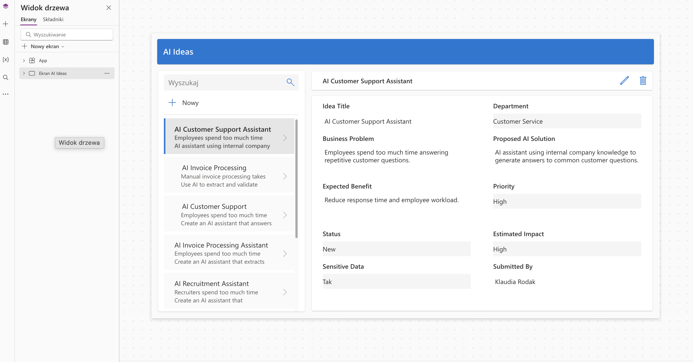
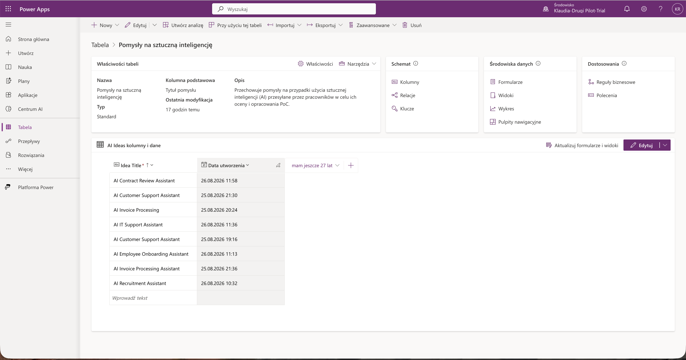
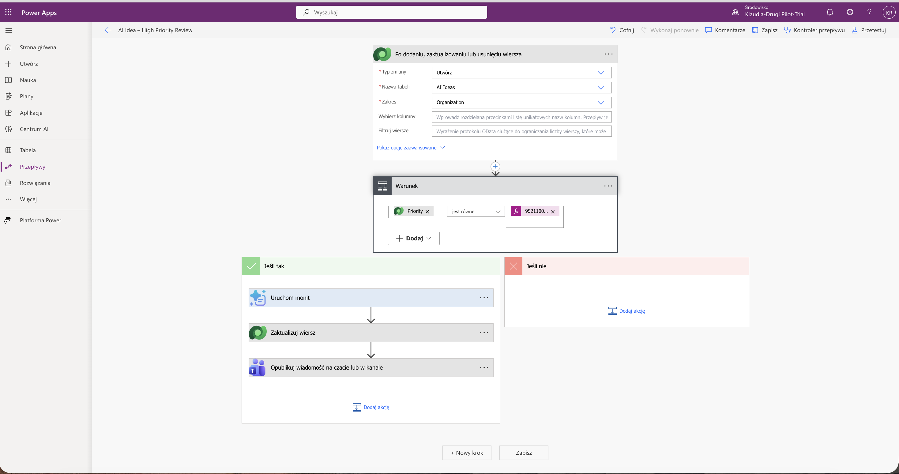
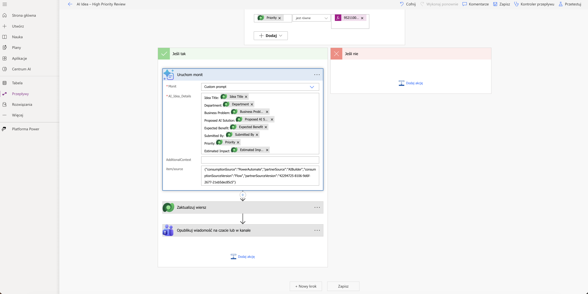
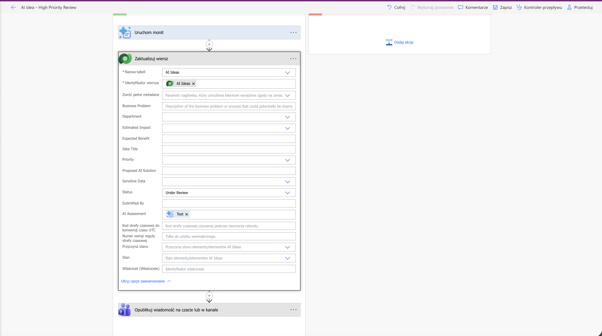
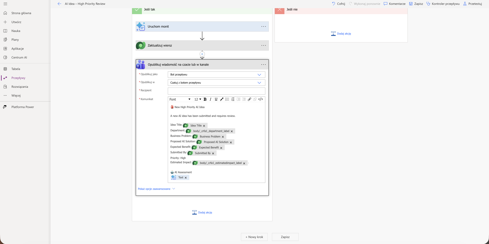
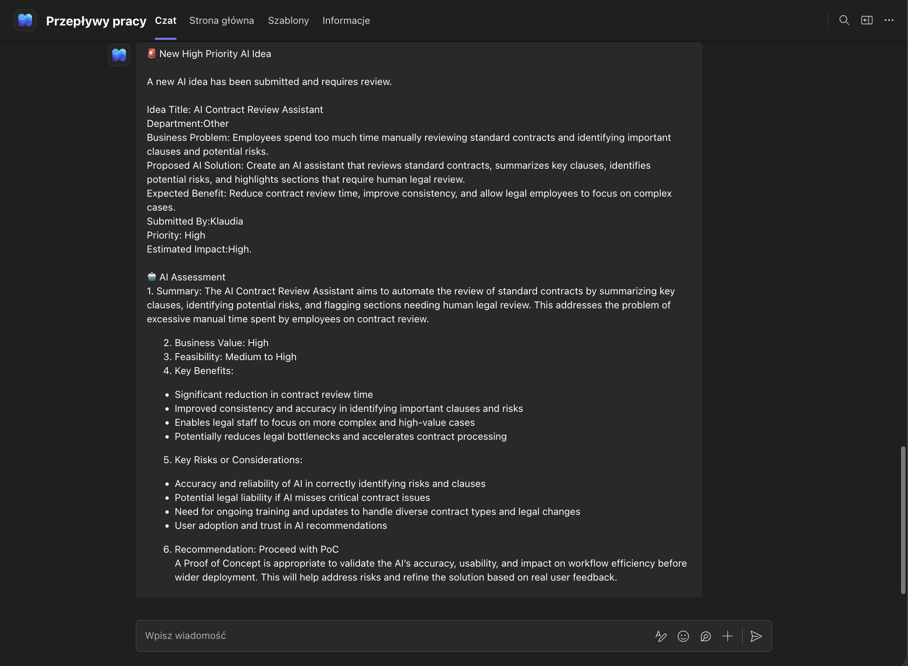

# AI Idea Management & Assessment System

A Microsoft Power Platform solution for collecting, evaluating, and managing AI use case ideas within an organization.

The system allows employees to submit AI ideas through a Power Apps application. High-priority ideas are automatically processed by a Power Automate workflow, evaluated using AI Builder, stored in Microsoft Dataverse, and sent to Microsoft Teams for review.

## Project Overview

Organizations often receive many ideas for potential AI use cases, but evaluating them manually can be time-consuming and inconsistent.

This project demonstrates how Microsoft Power Platform and generative AI can be combined to create an automated AI idea assessment workflow.

The solution:

- provides a central application for managing AI ideas,
- stores structured information in Microsoft Dataverse,
- detects high-priority AI ideas automatically,
- uses AI to perform an initial business assessment,
- updates the idea with the generated assessment,
- changes its status to **Under Review**,
- sends the complete assessment to Microsoft Teams.

## Architecture

The solution follows this workflow:

**Power Apps → Microsoft Dataverse → Power Automate → AI Builder → Dataverse → Microsoft Teams**

1. An employee submits an AI idea through Power Apps.
2. The idea is stored in the `AI Ideas` Dataverse table.
3. Power Automate detects the newly created record.
4. The flow checks the priority of the idea.
5. High-priority ideas are sent to an AI Builder custom prompt.
6. AI analyzes the business idea.
7. The generated assessment is saved back to Dataverse.
8. The idea status is changed to `Under Review`.
9. A notification containing the idea details and AI assessment is automatically sent to Microsoft Teams.

## AI Assessment

The AI evaluation considers several aspects of each proposed use case:

- summary of the idea,
- business value,
- feasibility,
- expected benefits,
- key risks and considerations,
- recommendation on whether the idea should proceed to a Proof of Concept (PoC).

The AI assessment is intended to support the initial evaluation process rather than replace human decision-making.

## Technologies

- Microsoft Power Apps
- Microsoft Dataverse
- Microsoft Power Automate
- AI Builder
- Generative AI / Custom Prompt
- Microsoft Teams
- Microsoft Power Platform

## Screenshots

### 1. Power Apps – AI Ideas Application

The application provides a central interface for browsing and managing submitted AI ideas.

### 2. Microsoft Dataverse – AI Ideas Table

AI ideas and their associated business information are stored in a structured Dataverse table.

### 3. Power Automate – Workflow Overview

The automated workflow detects new AI ideas and processes high-priority submissions.

### 4. AI Builder – Custom Prompt

Business information from the Dataverse record is dynamically passed to an AI Builder custom prompt for assessment.

### 5. Saving the AI Assessment

The generated assessment is stored in Dataverse and the idea status is automatically changed to `Under Review`.

### 6. Microsoft Teams Notification

Power Automate builds a Teams notification containing the original idea information and the generated AI assessment.

### 7. Final AI Assessment in Microsoft Teams

Example of a successfully processed high-priority AI idea.

The AI generated an assessment including business value, feasibility, benefits, risks, and a recommendation to proceed with a Proof of Concept.

## Example Use Case

One of the test cases used in the project was an **AI Contract Review Assistant**.

The proposed solution would use AI to:

- summarize important contract clauses,
- identify potential risks,
- highlight sections requiring human legal review,
- reduce the amount of manual contract analysis.

The automated assessment classified the idea as having:

**Business Value:** High  
**Feasibility:** Medium to High  
**Recommendation:** Proceed with PoC

The result was automatically stored and delivered to Microsoft Teams.

## What I Learned

Building this project allowed me to gain practical experience with:

- designing a business application using Power Apps,
- creating and structuring Dataverse tables,
- building automated workflows in Power Automate,
- working with triggers, conditions, and dynamic content,
- integrating generative AI into business processes,
- creating custom AI prompts,
- storing AI-generated results in Dataverse,
- integrating Power Platform solutions with Microsoft Teams,
- designing a simple AI use case assessment process,
- considering business value, feasibility, risk, and human oversight when introducing AI solutions.

## Potential Improvements

The project could be extended with:

- automatic routing of ideas to different reviewers,
- approval workflows,
- separate processing rules for medium-priority ideas,
- dashboards showing the AI idea pipeline,
- scoring and ranking of AI opportunities,
- notifications for idea owners,
- governance checks for sensitive data,
- additional human approval before moving an idea to PoC,
- reporting with Power BI.

## Project Purpose

This project was created as a practical Microsoft Power Platform and AI portfolio project.

It demonstrates how low-code tools, workflow automation, structured data, and generative AI can be combined to support an AI adoption and use case management process.
